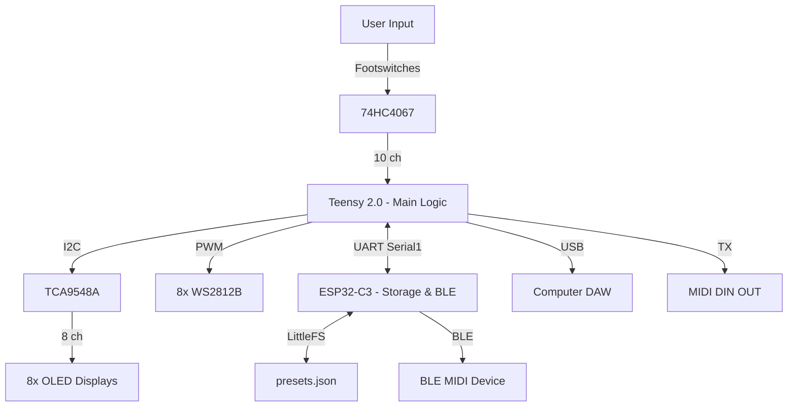

# Octostage: MIDI Foot Controller


**Octostage** is a high-performance, resource-constrained MIDI controller engineered for live performance. 

It pushes the limits of the **ATmega32U4 (Teensy 2.0)** by managing 8 OLED displays, 8 RGB LEDs, and 10 footswitches within a strict **2.5KB RAM** budget through aggressive multiplexing and shared memory strategies. It features a dedicated **ESP32-C3** co-processor to handle storage (JSON database) and native BLE MIDI connectivity.

---

## 🚀 Key Features

* **Hybrid Connectivity:** * **USB MIDI:** Low-latency connection for DAWs.
    * **DIN MIDI:** Standard 5-pin hardware output (via Serial1).
    * **BLE MIDI:** Wireless control for iOS/Android (via ESP32 Bridge).
* **Visual Feedback:**
    * **8x OLED Displays:** Dynamic labeling for every preset.
    * **8x RGB LEDs:** State indication (Active/Toggle) with color coding.
* **Engineering Optimizations:**
    * **Shared Video Buffer:** Renders 8 screens using only 512 bytes of RAM.
    * **Port Manipulation:** Reads 10 multiplexed buttons in nanoseconds.
    * **Client-Server Storage:** Offloads preset storage to ESP32, keeping Teensy RAM free.

---

## 🛠 System Architecture

The system uses a **Dual-MCU Topology** to separate Real-Time Logic (Teensy) from Data/Wireless (ESP32).



### 1. The RAM Challenge (Teensy 2.0)

The ATmega32U4 has only 2.5KB of RAM.

* **Naive Approach:** 8 Screens * 512 bytes = 4KB RAM (Crash 💥).
* **Octostage Solution:** One static 512-byte buffer. The firmware renders Screen 1, flushes to I2C, clears buffer, renders Screen 2, etc. This is done via "Time Slicing" to prevent blocking the MIDI loop.

### 2. The Data Strategy (Client-Server)

The Teensy does not parse JSON (too heavy).

1. **Storage:** ESP32 holds a `presets.json` file in Flash memory.
2. **Request:** Teensy sends `LOAD:1` via Serial.
3. **Process:** ESP32 parses JSON, converts "blue" to `enum ID`, packs a binary struct.
4. **Response:** ESP32 sends raw bytes back to Teensy.

---

## 🔌 Hardware Pinout

### Teensy 2.0 (Main Controller)

| Component | Pin (Teensy) | Port | Function |
| --- | --- | --- | --- |
| **I2C SCL** | D0 | PD0 | Clock for TCA9548A |
| **I2C SDA** | D1 | PD1 | Data for TCA9548A |
| **MIDI RX** | D2 | PD2 | Hardware Serial RX (from DIN) |
| **MIDI TX** | D3 | PD3 | Hardware Serial TX (to DIN & ESP32) |
| **LED Strip** | C6 | PC6 | WS2812B Data Line |
| **Mux Addr A** | B0 | PB0 | 74HC4067 S0 |
| **Mux Addr B** | B1 | PB1 | 74HC4067 S1 |
| **Mux Addr C** | B2 | PB2 | 74HC4067 S2 |
| **Mux Addr D** | B3 | PB3 | 74HC4067 S3 |
| **Mux SIG** | B5 | PB5 | 74HC4067 Signal (Input Pullup) |

### ESP32-C3 (Co-Processor)

| Pin (ESP32) | Connection | Note |
| --- | --- | --- |
| **RX** | Teensy TX (D3) | **Requires Voltage Divider (5V -> 3.3V)** |
| **TX** | Teensy RX (D2) | Direct connection OK |
| **5V** | PSU 5V | Powers the board |
| **GND** | Common GND | Essential |

---

## 📂 Project Structure

This repository is organized for **PlatformIO**.

```text
Octostage/
├── platformio.ini         # Environment Configuration
├── data/                  # Filesystem image for ESP32
│   └── presets.json       # The database of effects/colors
├── include/
│   ├── OctoConfig.h       # Hardware Definitions
│   ├── OctoMux.h          # Input Logic
│   ├── OctoDisplay.h      # Visual Logic
│   ├── OctoMidi.h         # Comms Logic
│   └── OctoStorage.h      # Persistence Logic
├── src/
│   ├── main.cpp           # Main Scheduler
│   ├── OctoMux.cpp        # Port Manipulation Code
│   ├── OctoDisplay.cpp    # Shared Buffer Implementation
│   ├── OctoMidi.cpp       # MIDI Routing
│   └── OctoStorage.cpp    # Serial Protocol
└── esp32_firmware/        # (Optional) Separate folder for ESP32 code
    └── src/main.cpp       # The JSON/BLE Server code

```

---

## ⚡ Getting Started

### 1. Hardware Assembly

Ensure you have the voltage divider between Teensy TX and ESP32 RX.

* **R1 (2.2kΩ):** Teensy TX -> ESP32 RX.
* **R2 (4.7kΩ):** ESP32 RX -> GND.

### 2. Flashing the Teensy 2.0

1. Open the project in **VS Code** with **PlatformIO**.
2. Connect Teensy via USB.
3. Run task: `PlatformIO: Upload`.

### 3. Flashing the ESP32-C3

1. Open the ESP32 project folder.
2. Edit `data/presets.json` to configure your pedals.
3. Run task: `Upload Filesystem Image` (to save JSON).
4. Run task: `PlatformIO: Upload` (to save firmware).

---

## 📝 Configuration (JSON Format)

You can customize your banks in `presets.json` inside the ESP32.

```json
[
  {
    "name": "Clean Amb",
    "bank_pc": 10,
    "switches": [
      {"lbl": "Comp", "col": "blue", "pc": 0, "cc": 10, "val": 127, "tog": 1},
      {"lbl": "Drive", "col": "green", "pc": 0, "cc": 11, "val": 127, "tog": 0}
      // ... up to 10 switches
    ]
  }
]

```

* **lbl:** Text on OLED (max 8 chars).
* **col:** `red`, `green`, `blue`, `yellow`, `purple`, `cyan`, `white`, `off`.
* **tog:** `1` for Toggle (On/Off), `0` for Momentary.

---

## 📜 License

This project is open-source software licensed under the [MIT license](https://www.google.com/search?q=LICENSE).

Developed by **Henry Hamon**.
